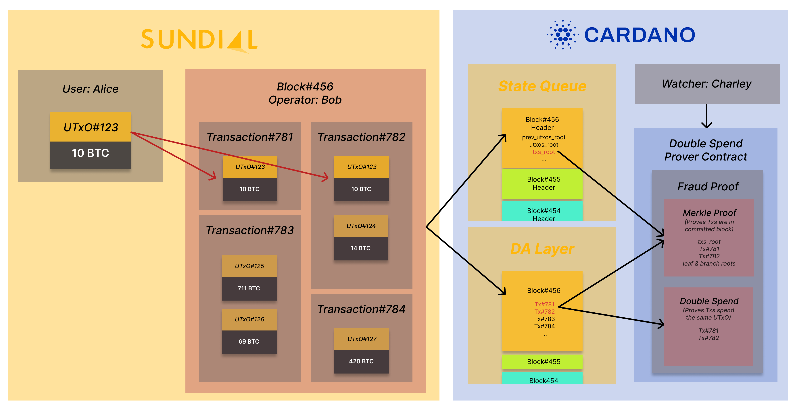

Sundial Litepaper
==================

|image1|\

Working Draft - July 21st, 2025

Sundial is the first optimistic rollup network on Cardano - custom built
to serve as Bitcoin’s utility and yield layer. It offloads transaction
processing from Layer 1 (L1) to Layer 2 (L2) while maintaining L1’s
security and decentralization properties for those transactions. As a
result, it can handle a significantly higher volume of transactions
without compromising on security. This whitepaper outlines the
interactions between L1 and L2, as well as going into detail about
Sundial’s specific target market fit: being a hybrid L2 for other UTxO
chains, including Bitcoin, and scaling new and novel use cases as a
“super” UTxO chain.

The optimistic rollup model implemented in Sundial represents a
significant advancement in the scalability and security of
general-purpose Layer 2 solutions on Cardano. Below are detailed
economic incentives that ensure the protocol’s integrity and efficiency.

                                                                      
*Sundial and Midgard are being developed in parallel, with Midgard to 
be the composible tech stack - similar to the Optimism tech stack on  
Ethereum. The above graphic is a display on how Midgard’s operators   
will operate. Sundial’s system will work in the same fashion.*        

Operators guarantee the validity of their committed blocks by posting
bonds, which are slashable if the blocks are proven invalid. Members of
the public are incentivized to watch the operators’ blocks, and they are
rewarded with a portion of the slashed bonds when their fraud proofs
prevent invalid blocks from merging into Sundial’s confirmed state.
Sundial’s architecture leverages a family of smart contracts on
Cardano’s L1 to manage state transitions and enforce the security of the
L2 operations. Key components include a robust operator management
system, efficient storage for transaction blocks committed from the L2,
and a comprehensive mechanism for submitting and validating fraud
proofs. Overall, Sundial’s design aims to provide a scalable and secure
solution for the growing needs of the Bitcoin and Cardano ecosystems and
beyond.

**Technical Overview:**

Sundial is a Layer 2 (L2) scaling solution for the Bitcoin and Cardano
blockchains. It employs optimistic rollup technology to enhance
Cardano’s base capacity to process transactions and host more complex
applications, delivering a richer user experience at a more competitive
cost. As Cardano continues to grow in usage and demand, scaling
solutions like Sundial are critical for maintaining high performance and
low transaction costs.

| Optimistic rollups process blocks of transactions off-chain and commit
  those blocks’ headers onchain to the L1 ledger. Each block is
  committed by a Sundial operator who guarantees the block’s validity.
  The block then waits in a queue for at least a fixed duration to be
  merged into the confirmed state of the optimistic rollup on L1. The
  operator must collateralize their guarantee with a bond deposit and
  publish the full contents of the block on the publicly accessible data
  availability (DA) layer. While a committed block is queued, anyone can
  inspect its contents on the data availability layer and ascertain
  whether it is valid. If someone detects that the block is invalid,
  they can submit a fraud proof to prevent it from being merged into the
  confirmed state, slash the operator’s bond, and receive a portion of
  the forfeited bond as a reward.
| An optimistic rollup can process a large number of transactions
  offchain while maintaining 1-of-n security and finality properties
  that are similar to transactions processed directly onchain, as long
  as:

-  The bond requirement for the rollup’s operators is large enough to discourage fraud.

-  The reward for preventing an invalid block from merging is large enough to encourage public vigilance in watching the operators.

-  The waiting period for committed blocks is long enough to allow the watchers to detect and prove fraud before those blocks are merged.

-  The data availability layer is accessible by anyone who wishes to inspect the rollup blocks at any time that they wish to do so.

Whenever the latter three security parameter values are calibrated to
provide a high probability of invalid blocks being detected and
disqualified, the bond requirement is a strong deterrent against
operators attempting fraud. An operator cannot dismiss the forfeited
bond as merely a “cost of doing business” paid to obtain potentially
larger revenues from fraud. Whenever an invalid block is disqualified,
it does not affect the confirmed state, so there are no revenues from
that fraud to offset the operator’s forfeited bond.

The main design goal of Sundial is to streamline the processes by which
blocks are committed/merged, fraud is detected, and fraud proofs are
verified onchain. Advancing this goal allows the security parameters to
be calibrated to achieve a better balance between security, transaction
throughput, confirmation time, and community participation in committing
blocks and detecting fraud.

**Scalability and Efficiency
**\ |image2|

By processing transactions off-chain and only validating them on-chain
when fraud proofs challenge them, Sundial significantly increases
throughput and reduces costs for Cardano transactions. Its rolled up
block headers use sparse Merkle trees and compact state representations
to enhance the protocol’s efficiency further, enabling it to handle a
large volume of transactions in a single L1 commitment.

These commitments are submitted by block producers who are selected via
rotating consensus using an onchain linked list, who are each given a
time window in which to submit however many commitments they like. This
allows the system to record blocks at a rate independent of the L1’s
speed, and allows its participants to anticipate the behaviour of the
L2. Combined with the deterministic fraud proving protocol, the
practical speed with which Sundial can process transactions is only rate
limited by the production of the operators and the processing of the
offchain observer.

The deterministic nature of Cardano transactions allows Sundial fraud
proofs to pinpoint the specific site of a transaction that violated
Sundial’s ledger rules, without having to look at any other parts of
that transaction, any other unrelated transactions within the block, or
any other blocks. This keeps fraud proofs and their onchain validation
procedures small and efficient, which reduces the time and cost needed
to submit fraud proofs when invalid blocks are detected, which makes it
feasible for a wider group of people to police Sundial’s blocks. In this
way, Sundial significantly reduces fraud proof size relative to
optimistic rollups used in Ethereum and other account-based blockchain
ecosystems, where a much larger part of the global blockchain state
needs to be inspected when constructing and verifying a fraud proof.

**Fraud Proofs and Block Integrity**

A central security pillar of Sundial Protocol is its fraud-proof
mechanism, a core feature of its optimistic rollup architecture adapted
to the unique advantages of the UTxO model. Fraud proofs enable any
participant in the system to challenge an invalid state transition
committed by a block operator. Unlike EVM-based rollups, where global
state must be reconstructed to verify fraud, Sundial benefits from the
deterministic and modular design of UTxO chains, allowing for targeted,
efficient dispute resolution.

Operators proposing new rollup blocks must stake a significant bond to
guarantee the validity of the block's transactions and resulting state
root. Once posted, each block enters a defined challenge window during
which any observer—known as a "watcher"—may submit a fraud proof. These
fraud proofs must isolate the specific invalid transaction or state
transition, citing protocol rule violations such as double spending,
invalid signature verification, unauthorized UTxO creation, or incorrect
fee deductions. Only the disputed transaction and its surrounding state
context are recomputed on-chain, leveraging the stateless execution
properties of UTxO systems to minimize validation costs.

To protect against denial-of-service or griefing attacks where malicious
challengers attempt to slow down finality by submitting fraudulent
disputes against honest blocks, Sundial requires both the operator and
the challenger to bond collateral. If a fraud proof is valid, the
operator's bond is slashed and partially awarded to the challenger.
Conversely, if the proof is invalid, the challenger forfeits their bond.
This bilateral bonding mechanism deters bad-faith reporting and ensures
that only well-founded claims are submitted.

| Consider a typical invalid block scenario:
| *Operator includes TX that spends UTxO#123 twice:*

*- User A's 10 BTC output is reused in two conflicting transactions.*

*- Block root reflects only first spend; watcher detects absence of
second output.*

*- Fraud proof references TX index and UTxO path; on-chain check
confirms duplication.*

In the above example a dishonest operator constructs a block that
includes two transactions, both attempting to spend the same UTxO
output. Since the UTxO model enforces strict one-time use per output,
the second transaction violates consensus rules. A watcher, observing
this duplication, generates a fraud proof by submitting the transaction
index, relevant Merkle proof path, and a minimal execution context to
the L1 contract.

The hash of the first in a series of onchain scripts designed for
validating this type of fraud is selected from an extensible fraud proof
catalogue, and the verification begins at this step. These scripts form
a computation thread (essentially a linear state graph) which passes
from one script to the next as each one handles a granular piece of
validation. At the final step the block is rolled back, and the operator
penalized. This design allows for the ledger rules to be easily updated
& enforced, and maximizes the simplicity of fraud proving by breaking it
into minimal portions.

To ensure timely finality and efficient throughput, Sundial incorporates
design insights from partners such as Anastasia Labs (L2 functionality),
CheckPoint (security and chain optimization), and FluidTokens (L2
functionality and BTC integration inputs). Torram's planned contribution
and collaboration with Sundial’s infrastructure further supports
real-time monitoring and light-client-compatible validation mechanisms,
enabling decentralized fraud detection without relying on centralized
oracles or heavy computational re-execution.

Ultimately Sundial is defined in two stages: off-chain inclusion
(typically sub-minute) and on-chain finalization after the fraud
challenge period expires. Because fraud proving is fully deterministic,
apps can treat off-chain inclusion with the same degree of certainty as
on-chain finality by simply running verification themselves. This
layered approach ensures that the majority of honest blocks are
confirmed quickly, while still enabling sufficient time for fraud
detection and mitigation. To prevent the protocol from being exploited
by mass challenges, future upgrades may adopt dynamic challenge windows
or randomized verifier sampling.

Sundial’s fraud-proof architecture reflects a philosophy of rigorous
security, user-level transparency, and economic accountability. By
tightly aligning incentives, leveraging the composability of UTxO
transactions, and ensuring deterministic, stateless execution, Sundial
protects its rollup integrity without compromising speed or user
autonomy.

**Censorship resistance and fallback mechanisms**

| On its own, the optimistic rollup mechanism described above ensures a
  high-level of assurance for the validity of block headers committed to
  the state queue and merged to Sundial’s confirmed state. However, it
  does not prevent operators from censoring users’ deposits,
  withdrawals, and L2 transactions. Consequently, Sundial’s consensus
  protocol includes additional smart contract mechanisms to provide
  censorship resistance for these events.
| Sundial deposits and withdrawals are initiated via L1 smart contracts
  that assign definite inclusion times to them. An operator block is
  invalid if it contains these inclusion times in its event interval but
  fails to include the associated deposit or withdrawal events. This
  ensures that if operators continue committing blocks to Sundial’s
  state queue, then they cannot ignore deposit and withdrawal events.
  Sundial L2 transaction requests are typically submitted to operators
  via a publicly accessible API, and they can be ignored by operators.
  However, any user can escalate his L2 transaction request by posting a
  transaction order on L1. Similar to Sundial deposits and withdrawals,
  an L1 transaction order is assigned an inclusion time that guarantees
  its inclusion in a subsequent valid block.

| |image3|
| If Sundial operators stop committing blocks at all to the state queue,
  then the inclusion times on their own cannot guarantee that deposits,
  withdrawals, and L2 transactions will be processed in a timely manner.
  However, for this extreme case, Sundial’s consensus protocol includes
  the escape hatch mechanism, which allows a special non-optimistic
  block to be appended to the state queue by a non-operator. This block
  can include any deposits, withdrawals, and L2 transactions that are
  verified on L1 to comply with Sundial’s ledger rules. This ensures
  that user funds cannot be stranded on Sundial even if its operators
  entirely stop committing blocks.

**Sundial Use Cases**

The UTxO model, used by Bitcoin, Dogecoin, Litecoin, and other major
blockchains, lacks native smart contract capabilities. As a result,
trillions of dollars in hard assets remain idle, unable to generate
yield or utility. Previous attempts at Bitcoin Layer-2 solutions,
primarily using Ethereum Virtual Machine (EVM) architectures, have faced
security vulnerabilities, technical limitations, and adoption
challenges.

Sundial’s primary use case - beyond scaling Cardano - is to seamlessly
merge Bitcoin’s vast liquidity with Cardano’s advanced eUTxO smart
contracts, enabling next-generation decentralized finance (DeFi). As the
first sophisticated Layer-2 on Cardano, Sundial is purpose-built for
scalability, reduced transaction costs, and institutional-grade
security.

**Key Innovations**

Sundial introduces groundbreaking features to unlock new capabilities
for UTxO-based blockchains:

-  Babel Fees (Gas Abstraction) – Enables users to pay transaction fees with any token, enhancing DeFi accessibility and usability.

-  ZK Bridges – A fully trustless rollup bridge secured by zero-knowledge proofs, ensuring seamless interoperability with metaprotocols.

-  Native UTxO Security – Greatly diminish vulnerabilities common in other blockchain ecosystems. Such vulnerabilities include but are not limited to:
   -  wallet drainers
   -  smart contract exploits
   -  fees for failed transactions
   -  network outages

-  Established Ecosystem Integrations – Day-1 ecosystem activity with leading DeFi, utility, RAW and gaming protocols coming from Cardano to drive adoption and usage.

**Core Benefits**

By integrating with Cardano Layer-1 and other UTxO chains, Sundial
becomes a hybrid Layer-2 solution, delivering:

-  Trustless UTxO Interoperability – Seamlessly connects Bitcoin, Cardano, and other UTxO-based assets.

-  Trading – Enables low-cost, high-speed on-chain and cross-chain asset exchanges.

-  Lending & Borrowing – Allows BTC, ADA, LTC, and other assets to be used as collateral in DeFi.

-  Staking & Yield Generation – Implements secure and sustainable on-chain rewards mechanisms.

-  DeFi & Web3 Integration – Positions BTC as a foundational asset for decentralized applications in finance, culture, and entertainment, leveraging Cardano’s existing ecosystem.

-  Institutional-Grade Compliance – Implements advanced compliance, reporting, and risk management tools to support institutional participation.

Sundial redefines the potential of UTxO assets, bridging the gap between
Bitcoin and smart contract-driven DeFi, unlocking liquidity, and
expanding the possibilities of blockchain finance.

**Conclusion**

Sundial is the first optimistic rollup on Cardano, designed to scale
transactions while preserving Layer 1 security and decentralization. By
serving as a hybrid Layer-2 for Bitcoin and other UTxO chains, Sundial
creates a “super” UTxO network, unlocking novel use cases and seamless
interoperability. With Bitcoin’s market capitalization projected to
reach $10 trillion by 2030, the need for scalable DeFi solutions is
greater than ever. While the EVM ecosystem thrives on cross-chain
connectivity, UTxO networks - despite being eight times larger - remain
isolated. Sundial bridges this gap, enabling trustless asset movement,
institutional-grade security, and the full integration of Bitcoin into
decentralized finance. Positioned as a critical infrastructure layer in
the evolving financial landscape, Sundial is set to redefine blockchain
scalability and utility.

